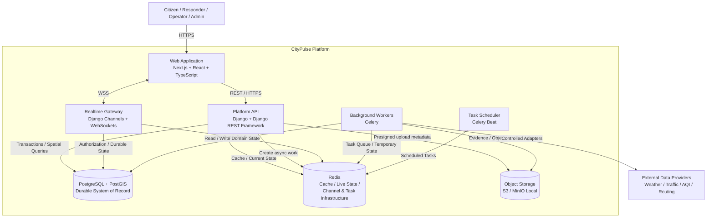

# CityPulse Container Architecture

## Purpose

This view opens the CityPulse system boundary and shows the major runtime
components responsible for delivering the product.

It describes deployment/runtime responsibilities, not individual classes
or Django models.

## Container View

## Containers

### Web Application

Technology:

- Next.js
- React
- TypeScript

Responsibilities:

- product UI
- command-center interface
- incident workflows
- map visualization
- live operational updates
- client-side interaction
- authenticated user experiences

The web application does not make authorization decisions on behalf of the
backend.

## Platform API

Technology:

- Python
- Django
- Django REST Framework
- GeoDjango

Responsibilities:

- authentication integration
- authorization
- business workflows
- REST APIs
- transactional operations
- geospatial queries
- incident management
- dispatch operations
- location-session management
- administrative workflows

The Platform API is initially one deployable modular application.

## Realtime Gateway

Technology:

- Django Channels
- WebSockets

Responsibilities:

- authenticated realtime connections
- subscription authorization
- incident updates
- responder location updates
- operational alerts
- connection lifecycle

Realtime messages are not authoritative storage.

Clients must be capable of recovering authoritative state through normal APIs.

## Background Workers

Technology:

- Celery

Responsibilities:

- external data ingestion
- notification fan-out
- evidence-processing workflows
- analytical aggregation
- retention jobs
- retryable integrations
- asynchronous domain work

Tasks must be designed for retry and duplicate delivery.

## Task Scheduler

Technology:

- Celery Beat

Responsibilities:

- scheduled provider ingestion
- periodic cleanup
- retention enforcement
- aggregation jobs
- operational maintenance tasks

Only one logical scheduler should be active for a given schedule.

## PostgreSQL / PostGIS

Responsibilities:

- authoritative transactional data
- user and authorization data
- incidents
- dispatch assignments
- geographic entities
- durable location history where required
- audit records
- spatial queries

PostgreSQL/PostGIS is the durable system of record.

## Redis

Responsibilities include:

- short-lived cache entries
- current live location state
- realtime channel infrastructure
- Celery broker-related infrastructure

These concerns should use clear namespaces and may use independently managed
Redis resources in production when isolation becomes necessary.

Redis is not the authoritative durable database.

## Object Storage

Production:

- Amazon S3

Local development:

- MinIO

Responsibilities:

- incident evidence
- uploaded media
- generated artifacts where appropriate

Large evidence files should not flow through Django application memory when
direct signed upload is appropriate.

## External Providers

External systems are accessed through adapters.

Examples:

- weather
- traffic
- environmental data
- routing

Provider-specific schemas must be normalized before entering domain logic.

## Communication Model

### Synchronous

Use synchronous communication when the caller requires an immediate result.

Examples:

    Web -> Platform API
    Platform API -> PostgreSQL
    Platform API -> Redis

### Asynchronous

Use asynchronous processing when work:

- is slow
- is retryable
- performs fan-out
- depends on external providers
- does not need to complete inside the user's request

Examples:

    API -> Celery task
    Scheduler -> ingestion task
    Worker -> external provider

### Realtime

Use WebSockets when connected clients need low-latency operational changes.

Examples:

    responder moved
    incident status changed
    dispatch assignment updated
    operational alert published

Realtime delivery complements REST APIs; it does not replace them.

## Failure Boundaries

### Redis Failure

Durable business state remains in PostgreSQL.

Realtime, cache, and asynchronous capabilities may degrade depending on the
specific Redis role affected.

### Worker Failure

Synchronous API operations should remain available where they do not depend on
worker completion.

Retry-safe tasks can be processed after recovery.

### External Provider Failure

Provider failure must not make the core CityPulse incident platform
unavailable.

Previously obtained information may be presented with freshness metadata where
appropriate.

### WebSocket Failure

Clients reconnect and recover authoritative state through REST before resuming
realtime updates.

### Object Storage Failure

Core incident metadata may still be created when business rules allow it.

Evidence upload can be retried independently.

## Architecture Boundary

The diagram shows logical runtime containers.

It does not imply that every container requires an independent repository,
database, server, or microservice.

Deployment topology is documented separately.