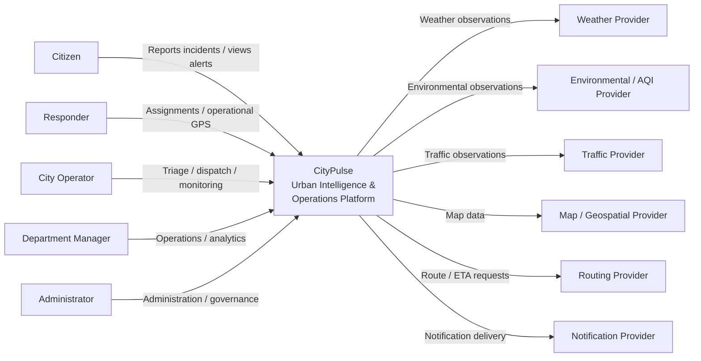

# CityPulse System Context

## Purpose

This view describes CityPulse from the outside.

It identifies the people and external systems that interact with the platform
without describing internal implementation details.

## Actors

### Citizen

Uses CityPulse to:

- view relevant city conditions
- report incidents
- upload evidence
- track submitted reports
- receive relevant alerts
- optionally share location for explicitly authorized workflows

### Responder

Uses CityPulse to:

- receive operational assignments
- update assignment state
- share duty location when authorized
- communicate operational progress

### City Operator

Uses CityPulse to:

- monitor city conditions
- review incoming incidents
- verify and prioritize incidents
- dispatch response units
- monitor active operations
- publish operational alerts

### Department Manager

Uses CityPulse for:

- department-level operational visibility
- escalations
- performance monitoring
- analytical reporting

### Administrator

Manages:

- users
- roles
- departments
- geographic scopes
- operational configuration
- security-sensitive administration

## External Systems

CityPulse may integrate with external systems through controlled adapters.

Examples include:

- weather data providers
- environmental / AQI providers
- traffic data providers
- map and geospatial data providers
- routing providers
- notification providers
- cloud infrastructure services

Provider-specific contracts must not leak directly into CityPulse domain
models.

## System Context

## Trust Boundaries

The context diagram intentionally hides internal implementation, but several
trust boundaries already exist.

### Public Client Boundary

Citizen devices are untrusted clients.

All data received from clients must be validated and authorized server-side.

### Operational Client Boundary

Responders and operators are authenticated users but remain outside the trusted
backend boundary.

Authentication does not eliminate authorization requirements.

### External Provider Boundary

External provider responses are not trusted domain data.

Provider adapters must perform:

- timeout handling
- schema validation
- normalization
- source attribution
- retry control
- freshness tracking

### Sensitive Location Boundary

Live citizen and responder location requires stronger controls than ordinary
public map data.

Location access must be purpose-bound, scoped, and auditable where required.

## Out of Scope for This View

This diagram does not describe:

- frontend architecture
- backend modules
- databases
- Redis
- WebSockets
- workers
- AWS infrastructure
- deployment topology

Those belong to lower-level architecture views.